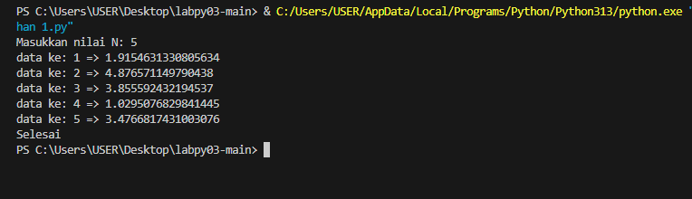
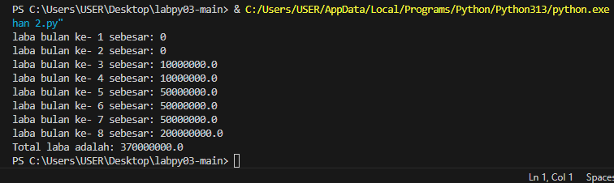
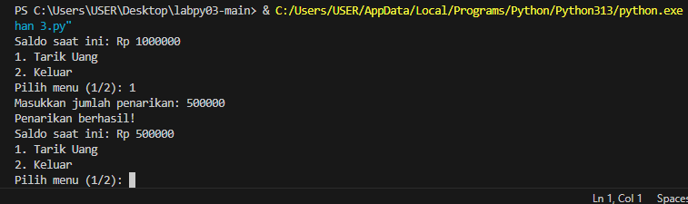

# Latihan 1
#### Hasil dari latihan 1

#### Code
````
import random

# Meminta pengguna memasukkan nilai n
n = int(input("Masukkan nilai N: "))

# Looping untuk menghasilkan n bilangan acak
for i in range(1, n + 1):
    # Menghasilkan bilangan acak antara 1 dan 5
    bilangan_acak = random.uniform(1, 5)

    # Menampilkan data ke-i dan nilai bilangan acak
    print(f"data ke: {i} => {bilangan_acak}")

print("Selesai")
````
#### Penjelasan alur algoritma program

1.Import Modul random: o Baris pertama import random digunakan untuk mengimpor modul random yang menyediakan berbagai fungsi untuk menghasilkan bilangan acak.

2.Meminta Input Pengguna: o Program meminta pengguna untuk memasukkan nilai n, yang merupakan jumlah bilangan acak yang ingin dihasilkan. Nilai n ini akan digunakan sebagai batas atas dalam perulangan.

3.Perulangan untuk Menghasilkan Bilangan Acak: o Menggunakan for i in range(1, n+1):, program melakukan perulangan sebanyak n kali. Dalam setiap iterasi:  random.uniform(1, 5) digunakan untuk menghasilkan bilangan acak dengan titik desimal (float) antara 1 (inklusif) dan 5 (inklusif).  Bilangan acak yang dihasilkan disimpan dalam variabel bilangan_acak.

4.Menampilkan Hasil: o Setiap bilangan acak yang dihasilkan akan ditampilkan bersama dengan nomor urutannya menggunakan format f"data ke: {i} => {bilangan_acak}". o Setelah semua bilangan acak dihasilkan dan ditampilkan, program akan mencetak pesan "Selesai" untuk mengindikasikan bahwa proses telah selesai. Penjelasan Fungsi random.uniform(a, b): • Fungsi ini menghasilkan bilangan acak dengan distribusi seragam (uniform) dalam rentang antara a (inklusif) dan b (inklusif). • Dalam contoh ini, a adalah 1 dan b adalah 5, sehingga bilangan acak yang dihasilkan akan berada di antara 1.0 dan 5.0.

## Latihan 2
#### Hasil dari latihan 2

#### Code
````
# Inisialisasi laba per bulan
laba = 0
total_laba = 0

# Loop untuk bulan 1 sampai 8
for bulan in range(1, 9):
    # Menentukan laba berdasarkan bulan
    if bulan in [1, 2]:  # Bulan 1 dan 2
        laba = 0
    elif bulan in [3, 4]:  # Bulan 3 dan 4
        laba = 10000000.0
    elif bulan in [5, 6, 7]:  # Bulan 5, 6, dan 7
        laba = 50000000.0
    elif bulan == 8:  # Bulan 8
        laba = 200000000.0
    
    # Menampilkan laba per bulan
    print(f"laba bulan ke- {bulan} sebesar: {laba}")
    
    # Menambahkan laba ke total laba
    total_laba += laba

# Menampilkan total laba
print(f"Total laba adalah: {total_laba}")
````
Penjelasan alur algoritma program • Inisialisasi Variabel: • laba = 0: Membuat variabel laba untuk menyimpan laba pada setiap bulannya. Diinisialisasi dengan nilai 0 karena belum ada perhitungan laba.
• total_laba = 0: Membuat variabel total_laba untuk menyimpan total laba dari semua bulan. Diinisialisasi dengan nilai 0.

• Perulangan untuk Setiap Bulan: 

• for bulan in range(1, 9):: Melakukan perulangan sebanyak 8 kali, mewakili 8 bulan. Pada setiap iterasi, variabel bulan akan bernilai dari 1 hingga 8.

• Menentukan Laba Berdasarkan Bulan: 

• Menggunakan struktur if-elif-else, program menentukan nilai laba untuk setiap bulan: o Jika bulan 1 atau 2, laba adalah 0. o Jika bulan 3 atau 4, laba adalah 10.000.000. o Jika bulan 5,6, atau 7, laba adalah 50.000.000. o Jika bulan 8, laba adalah 200.000.000.

• Menampilkan Laba per Bulan: 

• print(f"laba bulan ke- {bulan} sebesar: {laba}"): Mencetak ke layar informasi tentang laba pada bulan tertentu. 

• Menambahkan Laba ke Total Laba:

• total_laba += laba: Menambahkan nilai laba pada bulan tersebut ke dalam variabel total_laba.

• Menampilkan Total Laba: 

• Setelah perulangan selesai, program mencetak total laba yang telah dihitung dengan print(f"Total laba adalah: {total_laba}").

## Latihan 3
#### Hasil dari latihan 3

#### code
````
def atm():
  saldo = 1000000

  while True:
    print("Saldo saat ini: Rp", saldo)
    print("1. Tarik Uang")
    print("2. Keluar")
    pilihan = int(input("Pilih menu (1/2): "))

    if pilihan == 1:
      jumlah_tarik = int(input("Masukkan jumlah penarikan: "))
      if jumlah_tarik <= saldo:
        saldo -= jumlah_tarik
        print("Penarikan berhasil!")
      else:
        print("Saldo tidak mencukupi!")
    elif pilihan == 2:
      print("Terima kasih telah menggunakan ATM!")
      break
    else:
      print("Pilihan tidak valid!")

atm()
````
#### Penjelasan alur algoritma program

1.Definisi Fungsi atm(): o Program dimulai dengan mendefinisikan fungsi atm(). Fungsi ini akan menjalankan seluruh logika program ATM.

2.Inisialisasi Saldo: o Di dalam fungsi atm(), variabel saldo diinisialisasi dengan nilai 1000000. Ini mewakili saldo awal di rekening pengguna.

3.Perulangan Utama: o while True: memulai sebuah perulangan tak terbatas. Perulangan ini akan terus berjalan hingga pengguna memilih untuk keluar dari program. o Di dalam perulangan, program akan terus menampilkan menu pilihan kepada pengguna.

4.Menampilkan Menu: o Program menampilkan saldo saat ini dan dua pilihan:

5.Tarik Uang

6.Keluar

7.Meminta Input Pengguna: o Pengguna diminta untuk memilih salah satu opsi dengan memasukkan angka 1 atau 2. Pilihan pengguna disimpan dalam variabel pilihan.

8.Percabangan Kondisi: o Pilihan 1 (Tarik Uang): Pengguna diminta untuk memasukkan jumlah uang yang ingin ditarik. Jumlah penarikan diperiksa apakah lebih kecil atau sama dengan saldo yang ada. Jika saldo mencukupi, maka saldo akan dikurangi dengan jumlah penarikan dan menampilkan pesan "Penarikan berhasil!". Jika saldo tidak mencukupi, maka akan ditampilkan pesan "Saldo tidak mencukupi!". o Pilihan 2 (Keluar): Perulangan akan dihentikan dengan perintah break. o Pilihan Tidak Valid: Jika pengguna memasukkan pilihan selain 1 atau 2, maka akan ditampilkan pesan "Pilihan tidak valid!".

9.Panggilan Fungsi: o Di akhir program, fungsi atm() dipanggil untuk memulai eksekusi program. Algoritma dalam Bentuk Langkah-langkah Sederhana:

10.Mulai program.

11.Inisialisasi saldo dengan nilai tertentu.

12.Tampilkan menu pilihan kepada pengguna.

13.Minta pengguna memilih opsi.

14.Jika pengguna memilih "Tarik Uang": o Minta pengguna memasukkan jumlah yang ingin ditarik.
